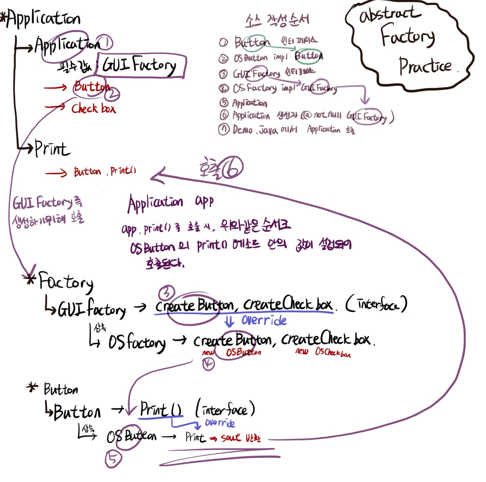

## AbstractFactory

### 1. 구조(package)
#### 1.1. app

#### 1.2. buttons
- Button.java
    - 공통 interface
    - Abstract Factory는 여러개가 있다.
    - 별도의 클래스 계층 구조(버튼과 체크박스)로 구성된다.
    - 동일한 클래스에는 공통 인터페이스가 있다.
    
- OSButton.java
    - 공통 인터페이스를 상속받는 클래스

#### 1.3. checkBoxes
- Checkbox.java
    - 체크박스는 두번째 생성자 이다
    - 버튼 패키지와 같은 구조로 되어있다.

#### 1.4. factories

#### 1.5. Demo.java

